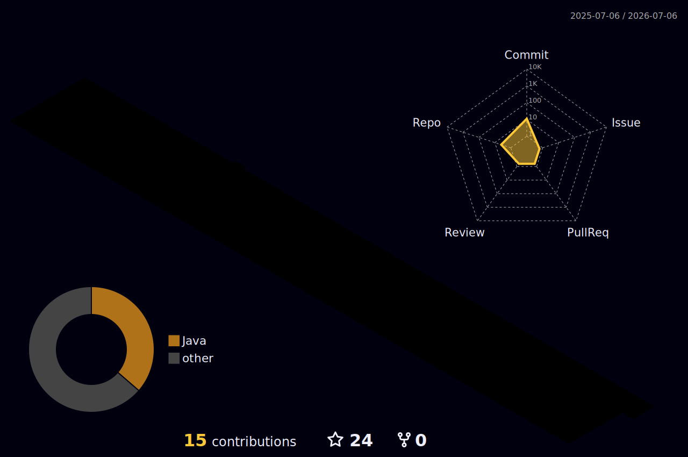

<!-- ════════════════════════════════════════════════════════════════ -->
<!--                      📌  QUICK SETUP GUIDE                          -->
<!--                                                                    -->
<!--  1. Create a PUBLIC repo named EXACTLY your username.              -->
<!--     (A user "octocat" makes a repo called  octocat/octocat .)      -->
<!--  2. Put this file in that repo, named  README.md                   -->
<!--  3. Find-and-replace everywhere in this file:                      -->
<!--       • YOUR_USERNAME  ->  your GitHub username                    -->
<!--       • YOUR_NAME      ->  your display name                       -->
<!--     Then edit the [bracketed] text and the social links near the   -->
<!--     bottom. Trim the tech icons (the i=... lists) to what YOU use  -->
<!--     — full icon list is at  skillicons.dev                         -->
<!--                                                                    -->
<!--  OPTIONAL — to turn on the 3D graph + the snake animation:         -->
<!--  4. Add the companion file at  .github/workflows/profile.yml       -->
<!--  5. Repo Settings -> Actions -> General -> Workflow permissions    -->
<!--       -> select "Read and write permissions" -> Save               -->
<!--  6. Actions tab -> run "Generate Profile Assets" once.             -->
<!--     (The 3D + snake images only appear AFTER it runs.)             -->
<!--                                                                    -->
<!--  Theme: violet (#8B5CF6) + tokyonight — swap colors freely.        -->
<!--  Note: the animated cards use free third-party services, so if an  -->
<!--  image ever fails to load, that service may be temporarily down.   -->
<!-- ════════════════════════════════════════════════════════════════ -->

<!-- ░░░░░░░░░░░░░░░░  ANIMATED HEADER BANNER  ░░░░░░░░░░░░░░░░ -->


<!-- ░░░░░░░░░░░░░░░░  TYPING ANIMATION + COUNTERS  ░░░░░░░░░░░░░░░░ -->
<div align="center">

  <a href="https://github.com/YOUR_USERNAME">
    
  </a>

  <br/><br/>

  
  <a href="https://github.com/YOUR_USERNAME?tab=followers">
    
  </a>
  <a href="https://github.com/YOUR_USERNAME?tab=repositories">
    
  </a>

</div>

---

## 🧑‍🚀 About Me

```ts
const YOUR_NAME = {
  role: "Full-Stack Developer",
  location: "[Your City, Country]",
  currentlyBuilding: "[your cool project]",
  learning: ["[new tech]", "[another skill]"],
  askMeAbout: ["JavaScript", "React", "Node.js", "[your thing]"],
  funFact: "[something fun about you]",
};
```

- 🔭 &nbsp;I'm currently working on **[your project]**
- 🌱 &nbsp;I'm currently learning **[technology / skill]**
- 👯 &nbsp;I'm looking to collaborate on **[open-source / ideas]**
- 💬 &nbsp;Ask me about **[your area of expertise]**
- ⚡ &nbsp;Fun fact: **[something interesting]**

---

## 🛠️ Tech Stack & Tools

<!-- Edit the i= list at skillicons.dev to match what YOU use. Full list: skillicons.dev -->
<div align="center">

**Languages**
<br/>


**Frontend**
<br/>


**Backend & Databases**
<br/>


**DevOps & Tools**
<br/>


</div>

---

## 📊 GitHub Analytics

<div align="center">

  
  

  <br/><br/>

  

</div>

---

## 🧊 3D Contribution Graph

<!-- This image appears AFTER you set up the included GitHub Action (see the .yml file). -->
<div align="center">
  
</div>

---

## 📈 Contribution Activity

<div align="center">
  
</div>

<!-- ░░░░░░░░░░░  SNAKE EATING CONTRIBUTIONS (needs the GitHub Action)  ░░░░░░░░░░░ -->
<div align="center">
  <picture>
    <source media="(prefers-color-scheme: dark)" srcset="https://raw.githubusercontent.com/YOUR_USERNAME/YOUR_USERNAME/output/snake-dark.svg" />
    <source media="(prefers-color-scheme: light)" srcset="https://raw.githubusercontent.com/YOUR_USERNAME/YOUR_USERNAME/output/snake.svg" />
    
  </picture>
</div>

---

## 🏆 GitHub Trophies

<div align="center">
  
</div>

---

## 💭 Dev Quote of the Moment

<div align="center">
  
</div>

---

## 🤝 Connect With Me

<div align="center">

  <a href="https://linkedin.com/in/YOUR_LINKEDIN">
    
  </a>
  <a href="https://twitter.com/YOUR_HANDLE">
    
  </a>
  <a href="mailto:YOUR_EMAIL@example.com">
    
  </a>
  <a href="https://YOUR-PORTFOLIO.com">
    
  </a>
  <a href="https://instagram.com/YOUR_HANDLE">
    
  </a>

</div>

<br/>

<!-- ░░░░░░░░░░░░░░░░  ANIMATED FOOTER BANNER  ░░░░░░░░░░░░░░░░ -->


<div align="center">
  <sub>⭐️ From <a href="https://github.com/YOUR_USERNAME">YOUR_USERNAME</a> — feel free to star repos you find useful!</sub>
</div>
